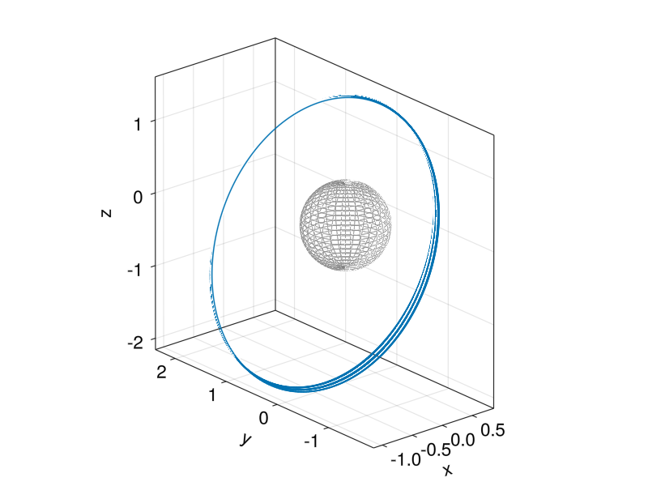

# FullEphemerisPropagator.jl

This repository contains an easily portable implementation of the full-ephemeris spacecraft dynamics (position & velocity). 

📚[Documentation here!](https://yuricst.github.io/FullEphemerisPropagator.jl/)📚

Using this set of code requires `SPICE.jl`, `OrdinaryDiffEq.jl`,  `Symbolics`,  `SymbolicUtils`, and `LinearAlgebra.jl`.

- [DifferentialEquations.jl documentation](https://docs.sciml.ai/DiffEqDocs/stable/)
- [Step size control](https://docs.sciml.ai/DiffEqDocs/stable/extras/timestepping/)

## Quick example

For the N-body problem, we can first do some setup:

```julia
using SPICE
using OrdinaryDiffEq   # could be DifferentialEquations.jl

include("../src/FullEphemerisPropagator.jl")

# furnish spice kernels
spice_dir = ENV["SPICE"]   # modify as necessary

# get spice kernels
furnsh(joinpath(spice_dir, "lsk", "naif0012.tls"))
furnsh(joinpath(spice_dir, "spk", "de440.bsp"))
furnsh(joinpath(spice_dir, "pck", "gm_de440.tpc"))

# define parameters
naif_ids = ["301", "399", "10"]                     # NAIF IDs of bodies
mus = [bodvrd(ID, "GM", 1)[1] for ID in naif_ids]   # GMs
naif_frame = "J2000"                                # NAIF frame
abcorr = "NONE"                                     # aberration  correction
lstar = 3000.0                                      # canonical length scale
```

Now for integrating, there are two APIs available; the high-level API is as follows:

```julia
# instantiate propagator
prop = FullEphemerisPropagator.Propagator(
    Vern9(),
    lstar,
    mus,
    naif_ids;
    naif_frame = naif_frame,
    reltol = 1e-12,
    abstol = 1e-12,
)

# initial epoch
et0 = str2et("2020-01-01T00:00:00")

# initial state (in canonical scale)
u0 = [
    -2.5019204591096096,
    14.709398066624694,
    -18.59744250295792,
    5.62688812721852e-2,
    1.439926311669468e-2,
    3.808273517470642e-3
]

# time span (1 day, in canonical scale)
tspan = (0.0, 86400/prop.parameters.tstar)

# solve
sol = FullEphemerisPropagator.propagate(prop, et0, tspan, u0)
```

If it is desirable to use `DifferentialEquations.jl`'s calls to `ODEProblem()` and `solve()` directly, we can do:

```julia
# construct parameters
parameters = FullEphemerisPropagator.Nbody_params(
    et0,
    lstar,
    mus,
    naif_ids;
    naif_frame=naif_frame,
    abcorr=abcorr
)

# initial epoch
et0 = str2et("2020-01-01T00:00:00")

# initial state (convert km, km/s to canonical scale)
u0_dim = [2200.0, 0.0, 4200.0, 0.03, 1.1, 0.1]
u0 = FullEphemerisPropagator.dim2nondim(prop, u0_dim)

# time span (1 day, in canonical scale)
tspan = (0.0, 30*86400/prop.parameters.tstar)

# solve
tevals = LinRange(tspan[1], tspan[2], 15000)   # optionally specify when to query states
prob = ODEProblem(FullEphemerisPropagator.eom_Nbody_SPICE!, u0, tspan, parameters)
sol = solve(prob, Tsit5(), reltol=1e-12, abstol=1e-12)
@show sol.u[end];
```

Finally, plotting: 

```julia
using GLMakie
fig = Figure(resolution=(600,600), fontsize=22)
ax1 = Axis3(fig[1, 1], aspect=(1,1,1))
lines!(ax1, sol[1,:], sol[2,:], sol[3,:])
fig
```

<p align="center">
    
</p>

## References

### Propagating the STM 

If the state-transition matrix is also to be propagated, initialize the propagator object via

```julia
prop = FullEphemerisPropagator.PropagatorSTM(
    Vern9(),
    lstar,
    mus,
    naif_ids;
    use_srp = true,
    naif_frame = naif_frame,
    reltol = 1e-12,
    abstol = 1e-12,
)
```

### Solar radiation pressure (SRP)

Both `FullEphemerisPropagator.Propagator` and `FullEphemerisPropagator.PropagatorSTM` take as arguments `use_srp::Bool`. If set to `true`, then the SRP term is included. This is calculated based on three parameters, namely:

- `srp_cr` : reflection coefficient, non-dimensional
- `srp_Am` : Area/mass, in m^2/kg
- `srp_P`  : radiation pressure magnitude at 1 AU, in N/m^2

Note that the units for these coefficients are always expected to be in those defined in the definition here, even though the integration happens in canonical scales. 


## To-do's

- [x] Jacobian via `Symbolics.jl`
- [ ] Spherical harmonics
- [x] SRP
